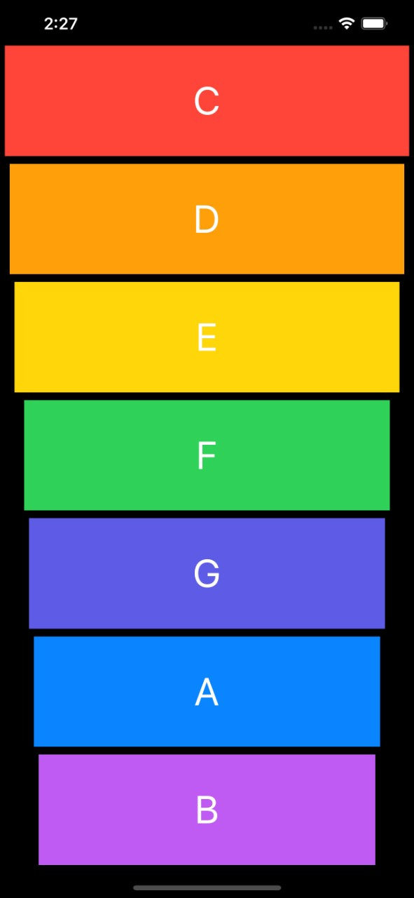

## iXylophone :tada:
Simple music playing iOS app , represented as a xylophone 

This app was developed as course project , the app simulates the musical behaviour of a xylophone , where each key represents a unique sound

## App UI

 

